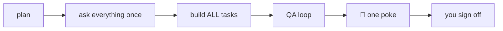

# ActionPlan Kit

Ship more, get interrupted less. Plan → answer **all** questions once → agents build everything →
QA by a different agent → **one poke** when it's your turn. Human signs off last.

## Install
```bash
git clone https://github.com/akshaynikhare/action-plan-kit && cd action-plan-kit
./install.sh --target ../my-repo --code AP          # add --with-e2e for the Playwright scaffold
```

## Daily use (in Claude Code)
| Command | When |
|---|---|
| `/ap:init` | Once per project — the intent interview (why, who, what, market) |
| `/ap:new <ask>` | File a story with acceptance criteria and a checklist |
| `/ap:ask` | Clear ALL open questions in one batch — then you're free |
| `/ap:run <id> [<id>…]` | The sprint: builds everything, gates, QA loop, ONE poke |
| `/ap:status` | Board + the Mirror (hard numbers, plain verdicts) |
| `make help` | Quick launch: dev · test · lint · check · status |

## The contract

- Questions are batched before code. Mid-sprint blockers get **parked**, never guessed.
- QA is always a **different agent** reading the diff only. No agent ever ticks human sign-off.
- Focused reviewers check acceptance coverage, caller regressions, security boundaries and cleanup when relevant.
- Completion requires final verification and sealed review evidence; the human ticks sign-off.
- One session per file — `.actionplan/locks/` stops parallel sessions colliding.
- No plan ids in code, ever. Agents never touch git.

## What lands in your repo
`.actionplan/` (plans, QA evidence, gates, scripts — agents' folder) · `docs/` (intent, constitution,
design, SDLC, engineering standard — your folder) · `Makefile` · `/ap:*` commands · `.mcp.json`.
Run kit gates directly: `node .actionplan/scripts/check.cjs` (works with an existing Makefile).

## Uninstall
```bash
rm -rf .actionplan .claude/commands/ap && git checkout CLAUDE.md AGENTS.md
```
