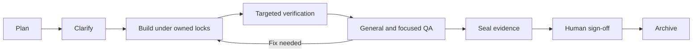

# Working with ActionPlan Kit

In the installed target repository, review `.actionplan/config.json` and launch Claude Code.

1. `/ap:init` records project intent and governing constraints.
2. `/ap:new <request>` drafts a story, acceptance criteria, concrete file manifest and targeted checks.
   Use `--light` for a small change; it still needs Files touched and verification.
3. `/ap:ask` critiques the plan and gathers all unresolved decisions in one batch.
4. `/ap:run <id>` claims files, builds tasks, executes verification and coordinates QA.
5. Review the final evidence and any parked tasks. Tick Human sign-off yourself when satisfied.
6. `/ap:stage <id> archived` validates the completion record before archiving.

Focused reviewers run according to the change: acceptance criteria, shared-contract regressions,
security boundaries and cleanup leftovers. They report findings without editing code.
Unresolved blockers are parked for the final notification; they are not silently guessed away.

Run gates directly with `node .actionplan/scripts/check.cjs`, regardless of any existing Makefile.
`/ap:verify` records targeted test output, lint/typecheck results and a file snapshot. Edits after
verification require a new run and affected QA. `/ap:status` shows the board and computed evidence gaps.
See the [completion contract](../kit/references/completion.md) for exact scripts and evidence files.

The kit's agent workflow leaves commits, pushes and publication to the human. Maintaining and
publishing this kit repository itself follows [RELEASING.md](RELEASING.md).
