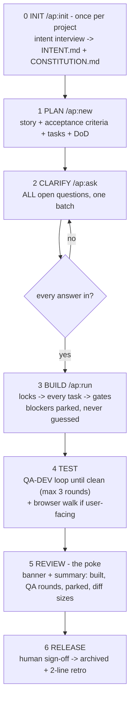

# SDLC — how work moves here

Two interruptions per sprint. Everything else runs without you.

| Kit | Scrum |
|---|---|
| `.actionplan/planned/` + `BACKLOG.md` | Product backlog |
| A plan file | User story + its sprint backlog |
| `R1, R2…` | Acceptance criteria |
| `/ap:ask` | Backlog refinement + sprint planning |
| `/ap:run` | The sprint — no mid-sprint scope talk |
| DoD block | Definition of Done |
| The poke | Sprint review |
| 2 lines at archive | Retrospective → durable lessons to `DECISIONS.md` / `PATTERNS.md` |

**The contract:** questions are batched before code; blockers found mid-sprint are parked with one line of why and surfaced first in the poke. The human is interrupted twice — at clarify, and at review. Never in between.
